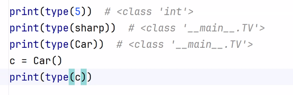
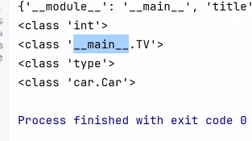

# python-OOP-Lec13-07-MAY-25
Object-Oriented Programming -Into
* 3 core principles of what is OOP:
  * class= define the pattern(blueprint) of the instance, every class is a module
    * start with Capital letter
  * object (entity) = created instance of the class
    * start with small letter.
  * encapsulation (הסתרה, הכמסה)= public/protected/private
  * inheritance= mechanism that allows one class (called a subclass or child class)
  * polymorphism= the ability of different objects to respond to the same method call in different ways.
  to acquire the properties and behaviors (methods and fields) of another class (called a superclass or parent class).
* SOLID =SOLID is sort for five design principles that help to design maintainable,scalable, and robust OO systems. 
These principles aim to reduce tight coupling, improve code organization,
and promote best practices in OOP. 
  * S — Single Responsibility Principle (SRP)
  * O — Open/Closed Principle (OCP)
  * L — Liskov Substitution Principle (LSP)
  * I — Interface Segregation Principle (ISP)
  * D — Dependency Inversion Principle (DIP)
* Methods= functions that describe the behaviors of the object
* Attributes (data)= properties definitions represent the state of the object
* dunder abilities:
  * Car.__dict__= reflection= investigate the class. is used to give more functionality.
    * usually within the class
  * __add__= to define an ability to concat objects
* c1=Car()= to create instance from Car class
* ways to import the class:
```
  #1.
  import car
  print(car.Car.speed)
  #2. 
  from car import *
  print(Car.speed)
  #3.
  from car import Car
  print(Car.color)
  #4.
  from car import Car as Ca
  print(Ca.type)
```
* ctrl+B = to open the class
* function type(obj1)=
 
 